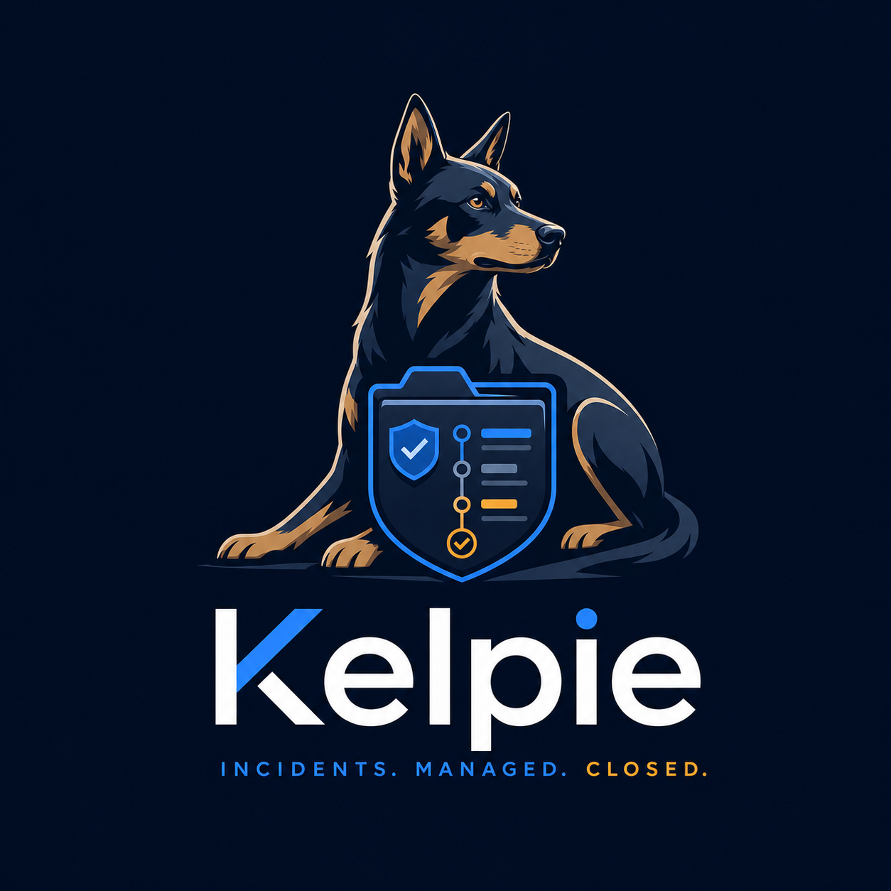

# Kelpie



Incident response and case management for small SOC teams. Open source, self-hosted.

> Incidents. Managed. Closed.

Kelpie is a SOC case management tool built as a single Next.js application backed by Postgres. It is designed to run cleanly on one modest VM.

## Features in this MVP

- Multi-tenant organisations, BetterAuth email-and-password sign-in, administrator / analyst / read_only roles.
- Inbound alert API (`POST /api/v1/alerts`), triage queue, dismiss or promote to a case.
- Cases with the full incident lifecycle (`open → in_progress → contained → eradicated → recovered → closed`), severity, TLP, PAP, classification, MITRE ATT&CK tagging, per-org case numbers (`KP-YYYY-NNNN`).
- Tasks with cadence: define playbooks with timed steps, applying a playbook spawns tasks with due times.
- Observables with manual entry, automatic carry-across from promoted alerts, cross-case lookup, and a pluggable enrichment interface (reverse DNS and URL parsing wired in).
- Append-only timeline that captures every state change, comment, task and observable event.
- Markdown comments with `@mention` email notifications.
- Local file attachments with SHA256.
- Dashboard with open cases by severity, MTTA / MTTC / MTTR, top classifications.
- Docker Compose deployment with Postgres.

The roadmap is tracked as GitHub issues under the **roadmap** label and the **Phase 2** and **Phase 3** milestones. Phase 2 (SLA jobs, PDF export, enrichment, webhooks, the REST API) and Phase 3 (integrations and scale) are now built; see [Phase 3 features](#phase-3-integrations-and-scale) below.

## Stack

- Next.js 16, React 19, server components and server actions.
- TypeScript, strict mode.
- Drizzle ORM with PostgreSQL.
- BetterAuth, with SAML 2.0 and OIDC single sign-on (via `@node-saml/node-saml` and a hand-rolled OIDC flow).
- Tailwind v4 with bespoke components (no shadcn install needed at MVP scope).
- Background work runs through internal `/api/cron/*` endpoints driven by an external scheduler (a Docker Compose sidecar in the bundled stack). No extra queue or worker process is required.

## Phase 3: integrations and scale

Phase 3 turns Kelpie from a standalone case manager into something that plugs into a SOC's existing tooling. Everything below is multi-tenant: configuration lives per organisation.

### SIEM connectors (Splunk, Elastic, Sentinel)

A single connector framework hosts every vendor. Each connector is one file under `src/lib/connectors/handlers/` that implements a small `poll()` interface; the framework handles scheduling, cursors, idempotent alert emission, and field mapping.

- **Configure** under **Settings → Integrations → SIEM connectors**. Pick a kind (Splunk, Elastic, Sentinel), name it, and fill in the credentials. The connector starts active.
- **Field mapping** is a single JSON document describing how a vendor record becomes a Kelpie alert (`title`, `description`, `severity` with a `severityMap`, `externalRef` for dedupe, and `observables`). Each connector ships a sensible default mapping.
- **Idempotency**: alerts are deduplicated on `externalRef`, so re-polling never creates duplicates.
- **Credential errors halt polling**: a failed poll records `last_error` on the connector and stops further polls until an admin clicks **Clear error**. Status (last poll, last error, total alerts produced) is visible per connector.
- Polling is driven by `POST /api/cron/connectors` (every minute in the bundled stack). **Poll now** runs a connector on demand.

Adding a new vendor is a single file implementing the `Connector` interface plus a line in `src/lib/connectors/registry.ts`.

### SOAR-style response actions (Cloudflare, Entra, CrowdStrike)

Kelpie is a case manager, not a SOAR, but a handful of well-bounded actions can be run straight from a case:

- **Block IP on Cloudflare** — creates a WAF access rule on the configured zone(s) for an IP observable.
- **Disable user in Microsoft Entra** — sets `accountEnabled=false` via Microsoft Graph for a username/email observable; records the previous state for manual rollback.
- **Isolate host in CrowdStrike** — resolves a hostname observable to a Falcon agent id and contains the device.

Configure credentials under **Settings → Integrations → Response actions** (admin only, per action enable/disable). On a case, the **Response actions** panel only offers actions whose required observable type is present. Running an action requires the admin or analyst role, shows a confirm dialog, and writes a `response_action` timeline event with the actor, target, and result. Every run is stored in `response_action_runs` for audit. Rollback is documented but not automated: run the inverse action manually.

New action handlers implement `ActionHandler` in `src/lib/response-actions/handlers/` and register in `registry.ts`.

### Threat intelligence store and feeds

A small TI store answers "is this IOC known bad?" as a sub-second indexed lookup.

- **Feeds** (generic CSV/TXT URL, MISP via API, OTX via API) are configured under the **Threat intel** page (admin). Each feed polls on its own interval (driven by `POST /api/cron/ti`), tracks last-poll status and indicator count, and halts on a credential error until cleared.
- **Automatic matching**: when an observable is created, Kelpie runs an indexed TI lookup and attaches matches to the observable's `enrichment.ti` immediately. The `ti` provider is also part of the enrichment registry, so later passes refresh it alongside reverse DNS, VirusTotal, etc.
- **Browse / search** the store from the **Threat intel** page: filter by value, type, feed, or tag. Each indicator's detail shows the feeds it came from (with confidence) and the cases it has appeared on.

New feed handlers implement `TiFeedHandler` in `src/lib/ti/handlers/`.

### Custom field builder

Admins can add fields to every case without code, under **Settings → Custom fields**.

- Field types: text, number, date, select, multi-select, yes/no. Fields can be reordered, deactivated, and marked required.
- Custom fields render inline on the case detail and are editable by analysts; every change writes a `custom_field_changed` timeline event.
- **Templates** can pre-fill custom field defaults, applied when a case is created from the template.
- **API**: `GET /api/v1/cases/{id}` returns `custom_fields: { key: value }`; `PATCH` accepts a `custom_fields` object with per-type validation and coercion. A basic equality filter over field values is available for the case list.

### Single sign-on (SAML 2.0 and OIDC)

Per-organisation SSO sits alongside email/password, configured under **Settings → Single sign-on** (admin).

- **OIDC** (Entra, Okta, Google Workspace, anything with discovery): set the issuer, client id/secret, scopes, and an optional role claim + role map. The flow uses OIDC discovery and PKCE. Sign-in URL: `/api/sso/oidc/{org-slug}/start`.
- **SAML 2.0**: paste the IdP SSO URL and signing certificate; assertion signatures are verified by `@node-saml/node-saml`. SP metadata is served at `/api/sso/saml/{org-slug}/metadata`, the ACS at `/api/sso/saml/{org-slug}/acs`, and sign-in starts at `/api/sso/saml/{org-slug}/start`.
- **Just-in-time provisioning**: the first successful sign in creates the user inside the organisation with the role from your claim mapping (falling back to `analyst`); subsequent sign ins refresh name and role.
- **Force SSO**: a per-org toggle that rejects email/password sign in for that organisation.

SSO sessions are BetterAuth-compatible: the callback creates a session row and sets the standard signed BetterAuth session cookie, so the rest of the app treats SSO and password sessions identically.

### Real-time presence and collaborative editing

- **Presence**: opening a case shows the avatars of other analysts viewing it, plus a "typing a comment" indicator. Transport is a Postgres-backed roster streamed over server-sent events at `/api/cases/{id}/presence`, so it works across app replicas without Redis. Rows expire after 30s of inactivity and are pruned on the cron tick.
- **Per-field locking and conflict handling**: editing a guarded case field (severity, classification, TLP, PAP, assignee, tags) shows an "X is editing this" indicator from presence. Saves carry an optimistic version stamp; a conflicting save is rejected with a 409 carrying the current value, and the UI offers keep-mine / keep-theirs. The same version guard is enforced on `PATCH /api/v1/cases/{id}` (send `version`; a stale value returns `409 version_conflict`).

The mobile companion app (issue #32) is intentionally out of scope for this build.

## Getting started (local dev)

```bash
# 1. Install dependencies
npm install

# 2. Configure environment
cp .env.example .env
# (the defaults work against the bundled docker-compose db)

# 3. Bring up Postgres (or run your own; just point DATABASE_URL at it)
docker compose up -d db

# 4. Generate and apply migrations, then seed
npm run db:generate
npm run db:migrate
npm run db:seed

# 5. Run the app
npm run dev
```

Then visit http://localhost:3000 and sign in as `admin@acme.local` / `kelpieadmin`.

## Docker Compose (self-hosted)

```bash
cp .env.example .env
# Set BETTER_AUTH_SECRET to a long random string before exposing publicly.
docker compose up -d --build
# First-run only: apply migrations and seed
docker compose exec app node -e "require('./src/db/migrate')" || npm run db:migrate
```

The compose stack starts Postgres, the Kelpie app, and a small cron sidecar. Uploads land in the `kelpie_uploads` volume.

## Background jobs (cron)

Background work runs through authenticated internal endpoints, hit once a minute by an external scheduler. The bundled `docker-compose.yml` includes a sidecar that curls them with `CRON_SECRET`. The endpoints are:

| Endpoint | Job |
| --- | --- |
| `POST /api/cron/sla` | SLA breach + warning checks and assignee email |
| `POST /api/cron/webhooks` | Outbound webhook delivery with retry/backoff |
| `POST /api/cron/enrichment` | Observable enrichment passes + cache purge |
| `POST /api/cron/connectors` | Poll active SIEM connectors |
| `POST /api/cron/ti` | Poll due TI feeds + prune stale presence rows |

Each requires `Authorization: Bearer $CRON_SECRET`. Point any scheduler (cron, a k8s CronJob, a GitHub Actions schedule) at them if you are not using the bundled sidecar.

## Smoke test

After seeding, with the dev server running:

```bash
npm run smoke         # Phase 1: alert round trip
npm run smoke:phase2  # Phase 2: cases/tasks/observables API, webhooks, reports, cron
npm run smoke:phase3  # Phase 3: connectors, response actions, TI, custom fields, presence, SSO
```

`smoke:phase3` exercises the Phase 3 backend directly against the database (TI ingestion + lookup, custom field validation, a response-action run with audit trail, a connector credential-failure halt, the presence roster, and SSO session-cookie signing).

## Sending alerts from a SIEM

```bash
curl -X POST http://localhost:3000/api/v1/alerts \
  -H "Authorization: Bearer klp_yourtoken" \
  -H "Content-Type: application/json" \
  -d '{
    "title": "Suspicious login from new geo",
    "severity": "high",
    "source": "siem-splunk",
    "observables": [{"type": "ip", "value": "203.0.113.4"}]
  }'
```

Create tokens under Settings → API tokens.

## Conventions

- Australian spelling in code, copy, and docs.
- No em dashes.
- Times are stored in UTC.
- The timeline is append-only. Never edited or deleted.
- Every state-changing action on a case writes a timeline event.

## License

This repository ships with no licence file by default. Add one that matches your distribution intent before publishing.
