# Kelpie

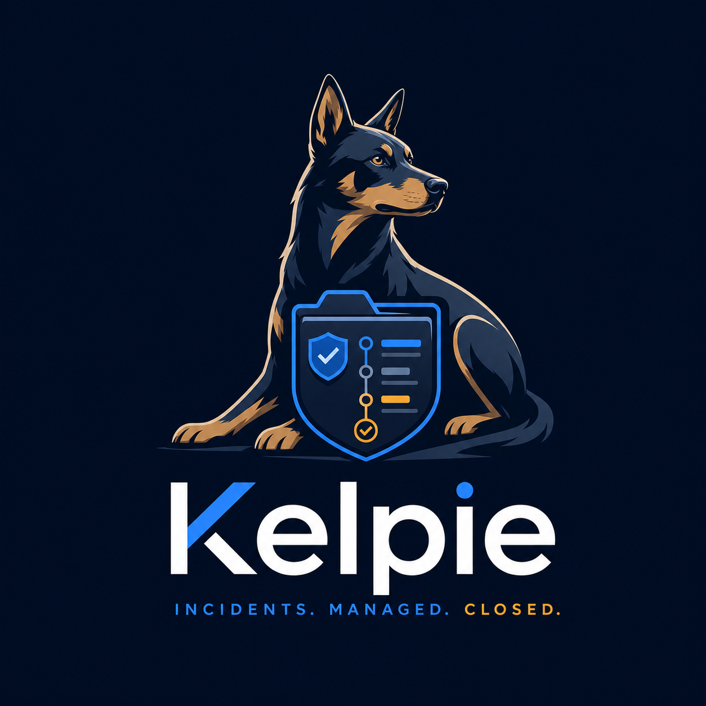

Incident response and case management for small SOC teams. Open source, self-hosted.

> Incidents. Managed. Closed.

[](https://railway.com/new/template?template=https%3A%2F%2Fgithub.com%2Fjusso-dev%2FKelpie&plugins=postgresql&envs=DATABASE_URL%2CBETTER_AUTH_SECRET%2CBETTER_AUTH_URL%2CAPP_URL%2CCRON_SECRET%2CEMAIL_FROM%2CSTORAGE_DRIVER%2CSTORAGE_LOCAL_DIR&DATABASE_URLDesc=Railway+Postgres+connection+string&DATABASE_URLDefault=%24%7B%7BPostgres.DATABASE_URL%7D%7D&BETTER_AUTH_SECRETDesc=Secret+used+to+sign+authentication+sessions&BETTER_AUTH_SECRETDefault=%24%7B%7Bsecret%2864%29%7D%7D&BETTER_AUTH_URLDesc=Public+origin+used+by+BetterAuth&BETTER_AUTH_URLDefault=https%3A%2F%2F%24%7B%7BRAILWAY_PUBLIC_DOMAIN%7D%7D&APP_URLDesc=Public+origin+used+for+links+and+SSO+callbacks&APP_URLDefault=https%3A%2F%2F%24%7B%7BRAILWAY_PUBLIC_DOMAIN%7D%7D&CRON_SECRETDesc=Secret+protecting+the+background+job+endpoints&CRON_SECRETDefault=%24%7B%7Bsecret%2864%29%7D%7D&EMAIL_FROMDesc=From+address+for+notification+emails&EMAIL_FROMDefault=kelpie%40example.com&STORAGE_DRIVERDesc=Attachment+storage+driver&STORAGE_DRIVERDefault=local&STORAGE_LOCAL_DIRDesc=Local+attachment+directory&STORAGE_LOCAL_DIRDefault=%2Fdata%2Fuploads)

Kelpie is a SOC case management tool built as a single Next.js application backed by Postgres. It is designed to run cleanly on one modest VM.

## Features in this MVP

- Multi-tenant organisations, BetterAuth email-and-password sign-in, administrator / analyst / read_only roles.
- Cases with the full incident lifecycle (`open → in_progress → contained → eradicated → recovered → closed`), severity, TLP, PAP, classification, MITRE ATT&CK tagging, per-org case numbers (`KP-YYYY-NNNN`).
- Tasks with cadence: define playbooks with timed steps, applying a playbook spawns tasks with due times.
- Observables with manual entry, cross-case lookup, and a pluggable enrichment interface (reverse DNS and URL parsing wired in).
- Append-only timeline that captures every state change, comment, task and observable event.
- Markdown comments with `@mention` email notifications.
- Automatic threat-intelligence enrichment comment when a case is created.
- Microsoft Sentinel incident import with source deduplication.
- Searchable Cyber brief with source and watched-vendor filters, sorting, and pagination.
- Organisation vendor watchlists backed by a 606-entry curated catalog with vendor icons and matched-report highlighting.
- Threat landscape showing near-real-time Cloudflare Radar application-attack activity.
- Scoped REST and MCP access to threat intelligence, Threat landscape, Cyber brief, and watched-vendor matches.
- Local file attachments with SHA256.
- Dashboard with open cases by severity, MTTA / MTTC / MTTR, top classifications.
- Docker Compose deployment with Postgres, Redis, and a dedicated BullMQ worker.

The original roadmap is tracked as GitHub issues under the **roadmap** label. Phase 2 and Phase 3 are shipped, including the native iOS companion and collaborative field editing; see [Shipped Phase 3 features](#shipped-phase-3-features) below.

## Product screenshots

Screenshots below were captured from a seeded local demo workspace with fake users, cases, threat intelligence, integrations, SSO, and custom-field data.

<details>
<summary>Operations workspace</summary>

### Dashboard

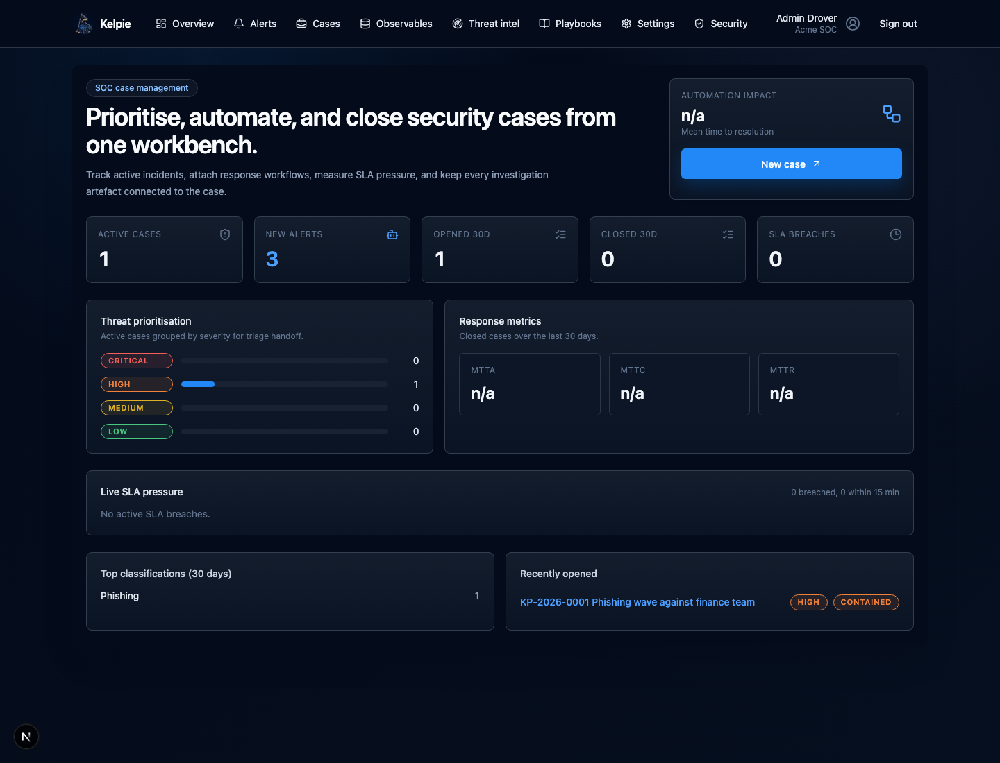

### Case list

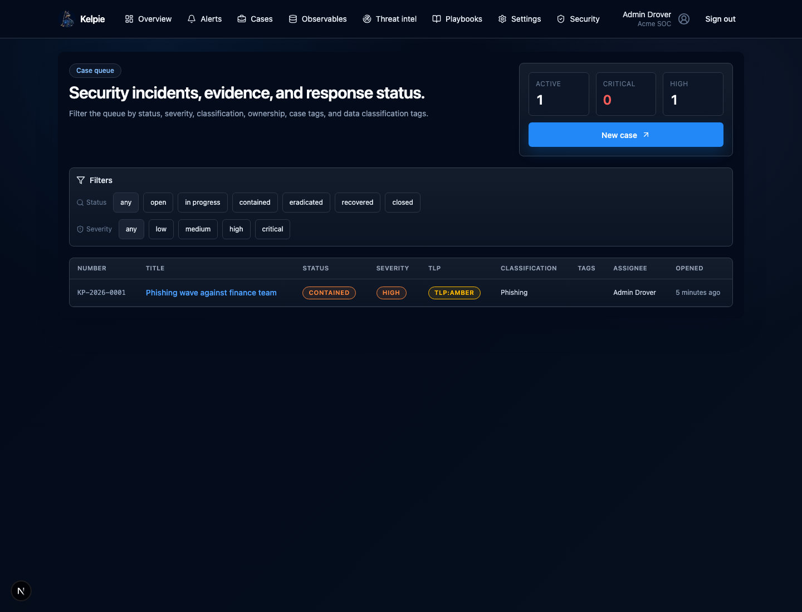

</details>

<details>
<summary>Case investigation</summary>

### Case detail

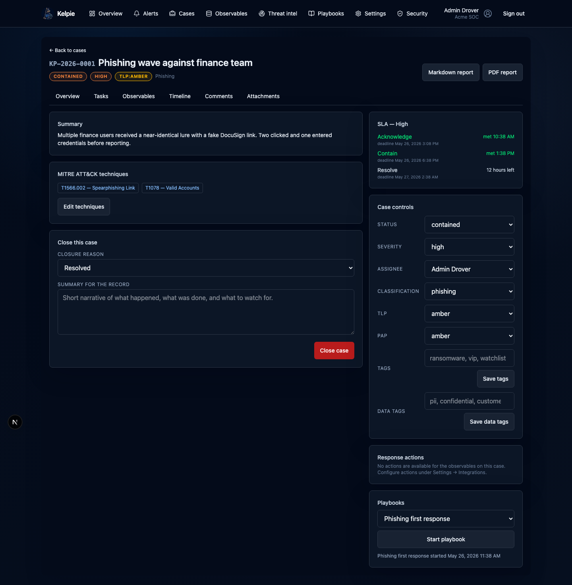

### Case observables

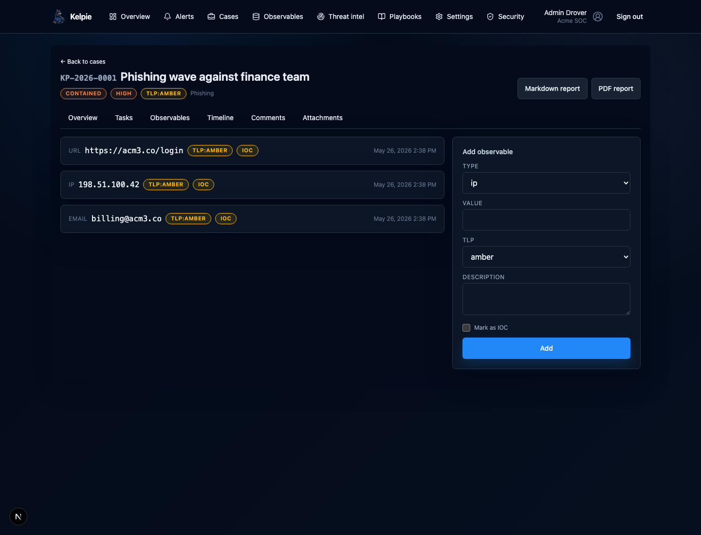

### Case comments

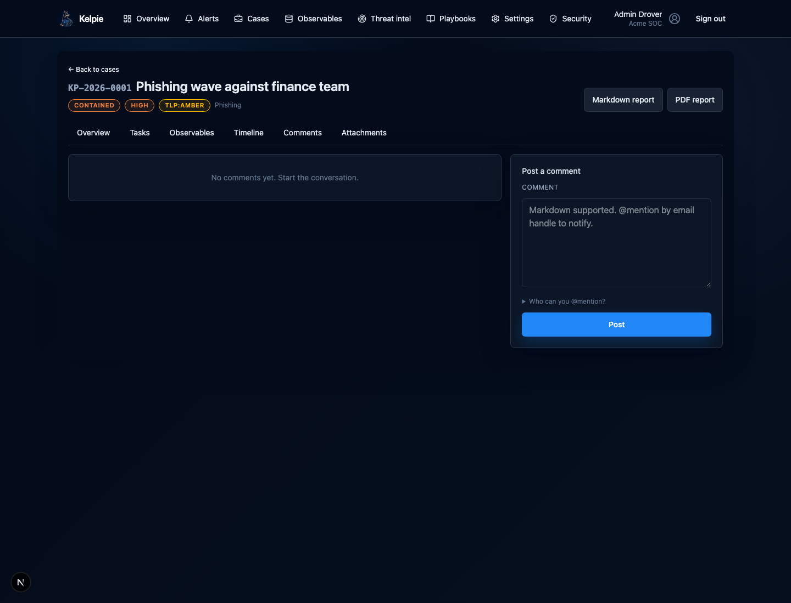

</details>

<details>
<summary>Threat data and response content</summary>

### Observable search

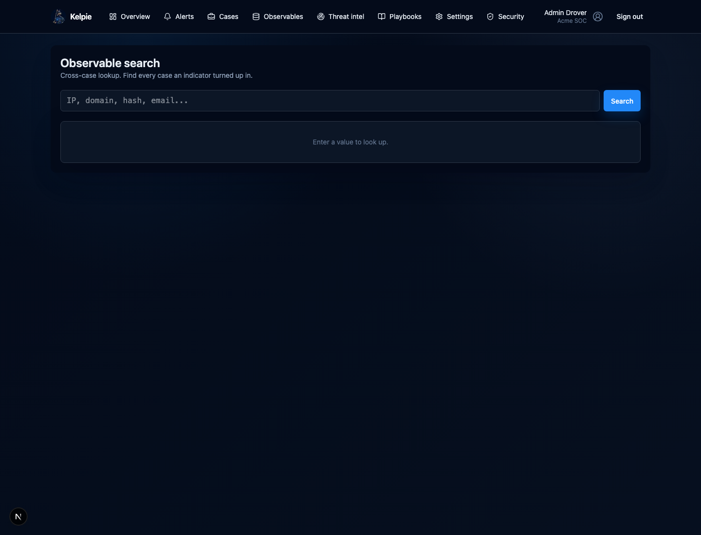

### Threat intelligence

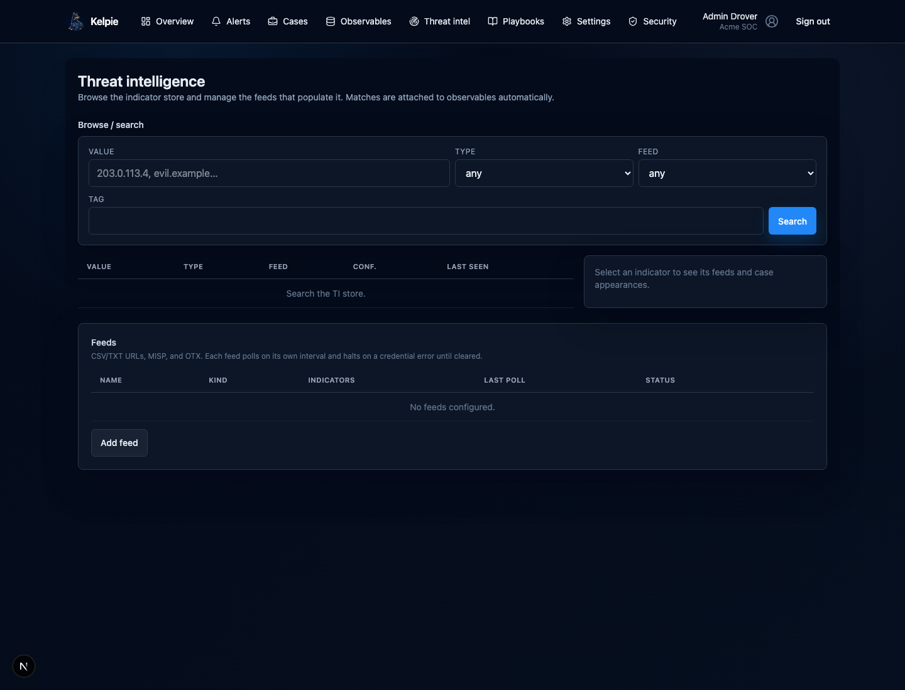

### Playbooks

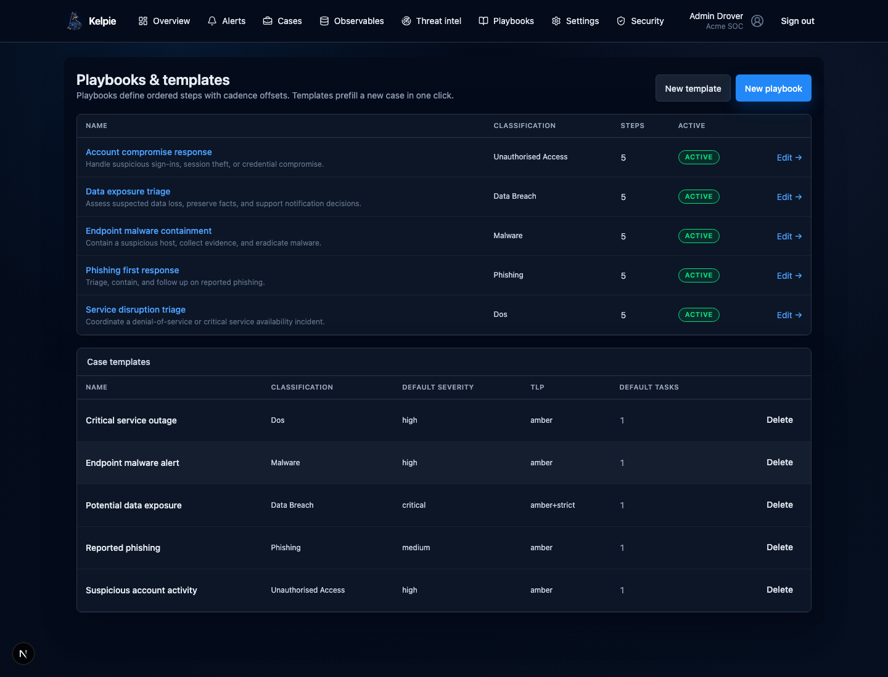

</details>

<details>
<summary>Administration</summary>

### Settings

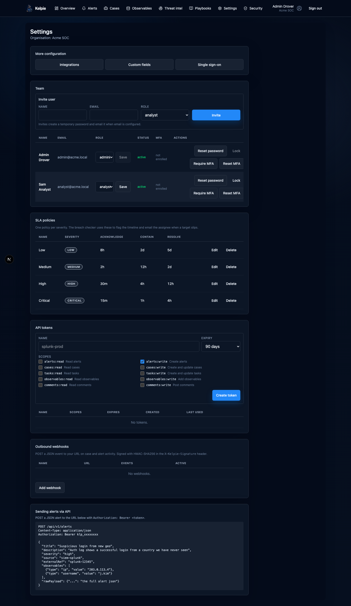

### Integrations

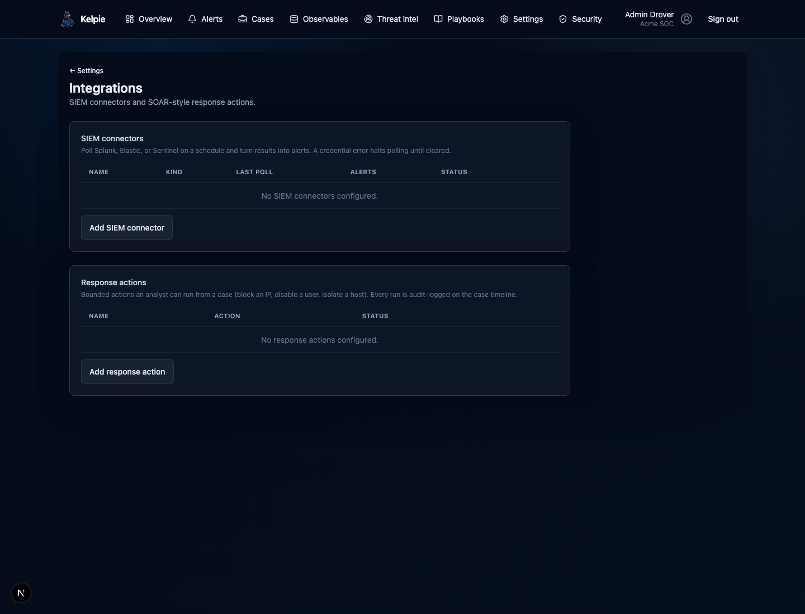

### Custom fields

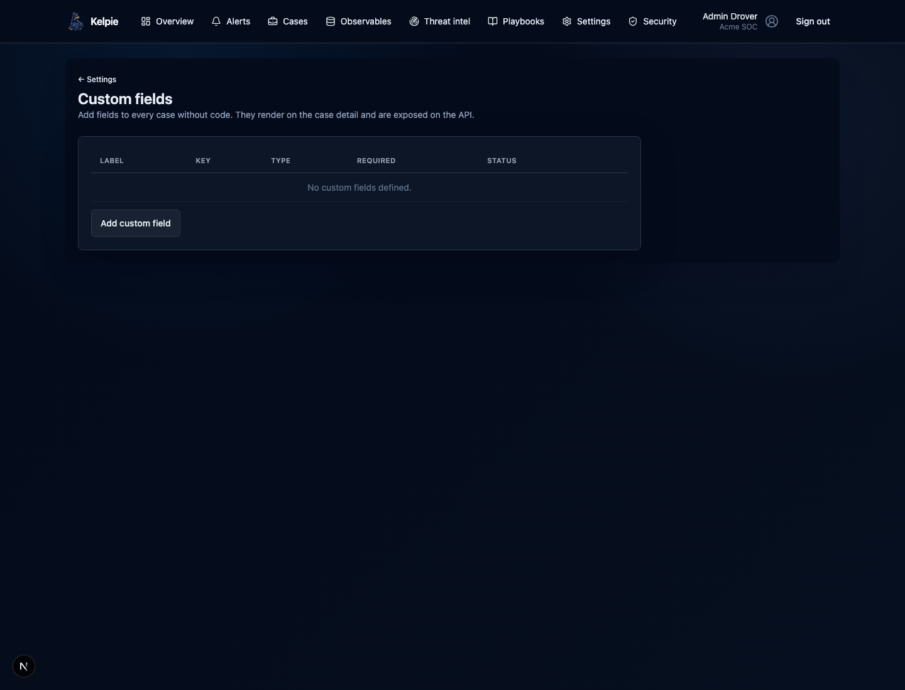

### Single sign-on

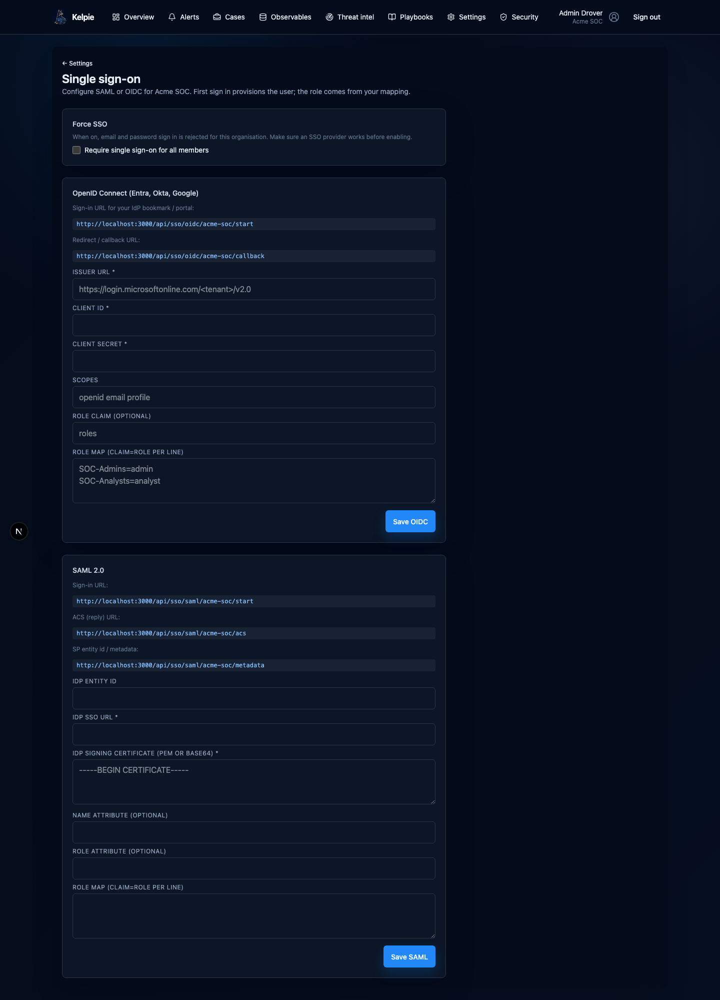

</details>

## Stack

- Next.js 16, React 19, server components and server actions.
- TypeScript, strict mode.
- Drizzle ORM with PostgreSQL.
- BetterAuth, with SAML 2.0 and OIDC single sign-on (via `@node-saml/node-saml` and a hand-rolled OIDC flow).
- Tailwind v4 with bespoke components (no shadcn install needed at MVP scope).
- Background work runs through BullMQ Job Schedulers backed by Redis. The bundled Compose stack runs a separate worker service with durable schedules, retry/backoff, and graceful shutdown.

## Shipped Phase 3 features

These shipped features turn Kelpie from a standalone case manager into something that plugs into a SOC's existing tooling. Everything below is multi-tenant: configuration lives per organisation.

### SOAR-style response actions (Cloudflare, Entra, CrowdStrike)

Kelpie is a case manager, not a SOAR, but a handful of well-bounded actions can be run straight from a case:

- **Block IP on Cloudflare** — creates a WAF access rule on the configured zone(s) for an IP observable.
- **Disable user in Microsoft Entra** — sets `accountEnabled=false` via Microsoft Graph for a username/email observable; records the previous state for manual rollback.
- **Isolate host in CrowdStrike** — resolves a hostname observable to a Falcon agent id and contains the device.

Configure credentials under **Settings → Integrations → Response actions** (admin only, per action enable/disable). On a case, the **Response actions** panel only offers actions whose required observable type is present. Running an action requires the admin or analyst role, shows a confirm dialog, and writes a `response_action` timeline event with the actor, target, and result. Every run is stored in `response_action_runs` for audit. Rollback is documented but not automated: run the inverse action manually.

### External case sources

Administrators can configure Microsoft Sentinel under **Settings → Integrations → Case sources**. Kelpie uses an Entra service principal to poll workspace incidents and creates cases directly, preserving the source link and reference. Repeated polls are idempotent. Closed incidents are excluded by default and can be enabled per source.

Every newly created case is checked against the organisation's local threat-intelligence store. Kelpie writes the result as an automated case comment, including matching feeds, confidence, and tags.

New action handlers implement `ActionHandler` in `src/lib/response-actions/handlers/` and register in `registry.ts`.

### Threat intelligence store and feeds

A small TI store answers "is this IOC known bad?" as a sub-second indexed lookup.

- **Feeds** (generic CSV/TXT URL, MISP via API, OTX via API) are configured under the **Threat intel** page. Each feed has an administrator-controlled BullMQ schedule, tracks last-poll status and indicator count, and retries transient failures.
- **Automatic matching**: when an observable is created, Kelpie runs an indexed TI lookup and attaches matches to the observable's `enrichment.ti` immediately. The `ti` provider is also part of the enrichment registry, so later passes refresh it alongside reverse DNS, VirusTotal, etc.
- **Browse / search** the store from the **Threat intel** page: filter by value, type, feed, or tag. Each indicator's detail shows the feeds it came from (with confidence) and the cases it has appeared on.

New feed handlers implement `TiFeedHandler` in `src/lib/ti/handlers/`.

### Cyber brief and vendor watch

The **Cyber brief** collects recent reporting from public cyber authorities. Users
can search headlines and summaries, filter by source or watched vendor, change the
sort order, and page through results.

Administrators and analysts can open **Cyber brief → Manage vendor watch** and
import from the bundled 606-entry vendor catalog. Kelpie uses each catalog
vendor's verified website and brand-icon fallbacks, then highlights reporting
whose headline or summary matches a watched vendor. A match is a lead for an
analyst to verify; it does not claim the organisation is affected.

### Threat landscape

The **Threat landscape** presents rolling 24-hour Cloudflare Radar
application-layer attack activity by observed origin, target, and route. Configure
`CLOUDFLARE_RADAR_API_TOKEN` with **Account → Radar → Read** permission. Kelpie
formats provider timestamps in the signed-in user's configured timezone.

REST consumers use `/api/v1/threat-intelligence`, `/api/v1/threat-landscape`,
and `/api/v1/briefing`. Agents can connect to the stateless Streamable HTTP MCP
endpoint at `/api/mcp`; create a scoped bearer token under **Settings → API
tokens**. See [API and MCP documentation](docs/api.md).

### Custom field builder

Admins can add fields to every case without code, under **Settings → Custom fields**.

- Field types: text, number, date, select, multi-select, yes/no. Fields can be reordered, deactivated, and marked required.
- Custom fields render inline on the case detail and are editable by analysts; every change writes a `custom_field_changed` timeline event.
- **Templates** can pre-fill custom field defaults, applied when a case is created from the template.
- **API**: `GET /api/v1/cases/{id}` returns `custom_fields: { key: value }`; `PATCH` accepts a `custom_fields` object with per-type validation and coercion. A basic equality filter over field values is available for the case list.

### Single sign-on (SAML 2.0 and OIDC)

Per-organisation SSO sits alongside email/password, configured under **Settings → Single sign-on** (admin).

- **OIDC** (Entra, Okta, Google Workspace, anything with discovery): set the issuer, client id/secret, scopes, and an optional role claim + role map. The flow uses OIDC discovery and PKCE. Sign-in URL: `/api/sso/oidc/{org-slug}/start`.
- **SAML 2.0**: paste the IdP SSO URL and signing certificate; assertion signatures are verified by `@node-saml/node-saml`. SP metadata is served at `/api/sso/saml/{org-slug}/metadata`, the ACS at `/api/sso/saml/{org-slug}/acs`, and sign-in starts at `/api/sso/saml/{org-slug}/start`.
- **Just-in-time provisioning**: the first successful sign in creates the user inside the organisation with the role from your claim mapping (falling back to `analyst`); subsequent sign ins refresh name and role.
- **Force SSO**: a per-org toggle that rejects email/password sign in for that organisation.

SSO sessions are BetterAuth-compatible: the callback creates a session row and sets the standard signed BetterAuth session cookie, so the rest of the app treats SSO and password sessions identically.

### Real-time presence and version-guarded edits

- **Presence**: opening a case shows the avatars of other analysts viewing it, plus a "typing a comment" indicator. Transport is a Postgres-backed roster streamed over server-sent events at `/api/cases/{id}/presence`, so it works across app replicas. Rows expire after 30s of inactivity and are pruned by the jobs worker.
- **Version-guarded field saves**: guarded case fields (severity, classification, TLP, PAP, assignee, tags) carry an optimistic version stamp. A conflicting save is rejected with the current value so the analyst can reload and choose what to keep. The same version guard is enforced on `PATCH /api/v1/cases/{id}` (send `version`; a stale value returns `409 version_conflict`).

### Native iOS companion

The SwiftUI companion under `apps/ios` is case-first: open cases, readable case detail, comments, assigned and team task queues, and task completion. It uses the same BetterAuth identities through dedicated least-privilege mobile bearer sessions stored in the iOS Keychain.

APNs notifications route SLA breaches to the assigned analyst and comment mentions to the mentioned user. See `apps/ios/README.md` for Xcode and simulator instructions.

## Deploy on Railway

[](https://railway.com/new/template?template=https%3A%2F%2Fgithub.com%2Fjusso-dev%2FKelpie&plugins=postgresql&envs=DATABASE_URL%2CBETTER_AUTH_SECRET%2CBETTER_AUTH_URL%2CAPP_URL%2CCRON_SECRET%2CEMAIL_FROM%2CSTORAGE_DRIVER%2CSTORAGE_LOCAL_DIR&DATABASE_URLDesc=Railway+Postgres+connection+string&DATABASE_URLDefault=%24%7B%7BPostgres.DATABASE_URL%7D%7D&BETTER_AUTH_SECRETDesc=Secret+used+to+sign+authentication+sessions&BETTER_AUTH_SECRETDefault=%24%7B%7Bsecret%2864%29%7D%7D&BETTER_AUTH_URLDesc=Public+origin+used+by+BetterAuth&BETTER_AUTH_URLDefault=https%3A%2F%2F%24%7B%7BRAILWAY_PUBLIC_DOMAIN%7D%7D&APP_URLDesc=Public+origin+used+for+links+and+SSO+callbacks&APP_URLDefault=https%3A%2F%2F%24%7B%7BRAILWAY_PUBLIC_DOMAIN%7D%7D&CRON_SECRETDesc=Secret+protecting+the+background+job+endpoints&CRON_SECRETDefault=%24%7B%7Bsecret%2864%29%7D%7D&EMAIL_FROMDesc=From+address+for+notification+emails&EMAIL_FROMDefault=kelpie%40example.com&STORAGE_DRIVERDesc=Attachment+storage+driver&STORAGE_DRIVERDefault=local&STORAGE_LOCAL_DIRDesc=Local+attachment+directory&STORAGE_LOCAL_DIRDefault=%2Fdata%2Fuploads)

The button provisions the web service and Postgres. A complete production deployment also needs Redis and a worker service, as described below.

After the first deploy:

1. Open the generated Railway domain and create the first organisation and administrator account.
2. For durable local attachments, attach a Railway volume to the Kelpie service at `/data`. Without a volume, attachments are lost on redeploy. Alternatively, configure the S3 variables from `.env.example`.
3. Add a persistent Redis service and set `REDIS_URL` on both Kelpie services.
4. Add a second service from the same image with start command `node scripts/jobs-worker.cjs`. Give it the same application environment plus `DATABASE_URL`, `REDIS_URL`, and optional `JOBS_CONCURRENCY`.

Kelpie rejects webhook, feed, response-action, and OIDC destinations that resolve to private or local network addresses. If your self-hosted deployment intentionally connects to services on its private network, set `KELPIE_ALLOW_PRIVATE_NETWORKS=true`. Leave it disabled for public integrations.

## Getting started (local dev)

```bash
# 1. Install dependencies
npm install

# 2. Configure environment
cp .env.example .env
# (the defaults work against the bundled docker-compose db)

# 3. Bring up Postgres and Redis (or point DATABASE_URL / REDIS_URL at your own)
docker compose up -d db redis

# 4. Generate and apply migrations, then seed
npm run db:generate
npm run db:migrate
npm run db:seed

# 5. Run the app
npm run dev
```

Then visit http://localhost:3000 and sign in as `admin@acme.local` / `kelpieadmin`.

## Docker Compose (self-hosted)

The production compose file pulls the `linux/amd64` image from GitHub Container Registry, applies migrations before starting Kelpie, keeps Postgres off the host network, and binds Kelpie to loopback for a local reverse proxy. Published images target x86_64 hosts such as the Ubuntu-based homelab deployment.

```bash
cp .env.example .env
# Set POSTGRES_PASSWORD, BETTER_AUTH_SECRET, CRON_SECRET, BETTER_AUTH_URL,
# APP_URL, and EMAIL_FROM. Generate long random values for all three secrets.
docker compose pull
docker compose up -d
```

The compose stack starts Postgres, persistent Redis, an idempotent migration job, Kelpie, and a dedicated BullMQ worker. Uploads land in the `kelpie_uploads` volume. Put TLS and public ingress at a reverse proxy (for example Caddy or Traefik) on the same host. Set `KELPIE_BIND_ADDRESS=0.0.0.0` only when direct network exposure is intentional.

Images publish from `main` and `v*` tags to `ghcr.io/jusso-dev/kelpie`. First release requires changing package visibility to **Public** in GitHub package settings; homelab hosts can then pull without credentials. Pin deployments to a release tag or digest after validation instead of tracking `latest`:

```bash
KELPIE_IMAGE=ghcr.io/jusso-dev/kelpie:v1.0.0 docker compose pull
KELPIE_IMAGE=ghcr.io/jusso-dev/kelpie:v1.0.0 docker compose up -d
```

## Background jobs (BullMQ)

The `jobs` service runs `scripts/jobs-worker.cjs` against persistent Redis. BullMQ owns recurring schedules for SLA checks, webhook delivery, observable enrichment, mobile push delivery, presence cleanup, each enabled TI feed, and each enabled external case source.

Administrators set feed and case-source intervals under **Settings → Integrations → Automation schedules**. Kelpie stores the desired schedule in Postgres; the worker reconciles BullMQ Job Schedulers within one minute. Jobs retry three times with exponential backoff, completed history is retained for 24 hours, and failed history for seven days.

The authenticated `/api/cron/*` routes remain available for manual recovery and backwards compatibility. They are not used by the bundled Compose stack.

## Smoke test

After seeding, with the dev server running:

```bash
npm run smoke         # Basic case API round trip
npm run smoke:phase2  # Phase 2: cases/tasks/observables API, webhooks, reports, cron
npm run smoke:phase3  # Phase 3: response actions, TI, custom fields, presence, SSO
npm run test:mobile   # iOS sessions and case notification routes
```

`smoke:phase3` exercises the Phase 3 backend directly against the database (TI ingestion + lookup, custom field validation, a response-action run with audit trail, the presence roster, and SSO session-cookie signing).

## Creating cases through the API

```bash
curl -X POST http://localhost:3000/api/v1/cases \
  -H "Authorization: Bearer klp_yourtoken" \
  -H "Content-Type: application/json" \
  -d '{
    "title": "Suspicious login investigation",
    "summary": "Successful login from an unusual location.",
    "severity": "high",
    "classification": "unauthorised_access",
    "tags": ["identity"]
  }'
```

Create tokens under Settings → API tokens.

## Conventions

- Australian spelling in code, copy, and docs.
- No em dashes.
- Times are stored in UTC.
- The timeline is append-only. Never edited or deleted.
- Every state-changing action on a case writes a timeline event.

## License

This repository ships with no licence file by default. Add one that matches your distribution intent before publishing.
